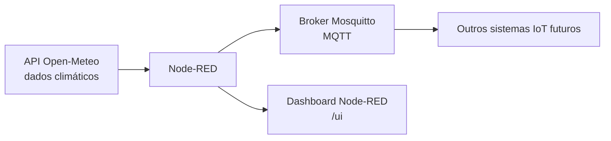
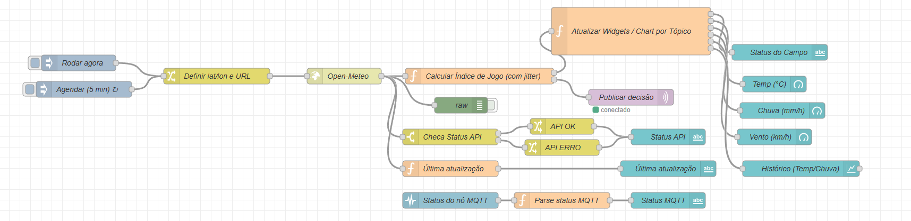
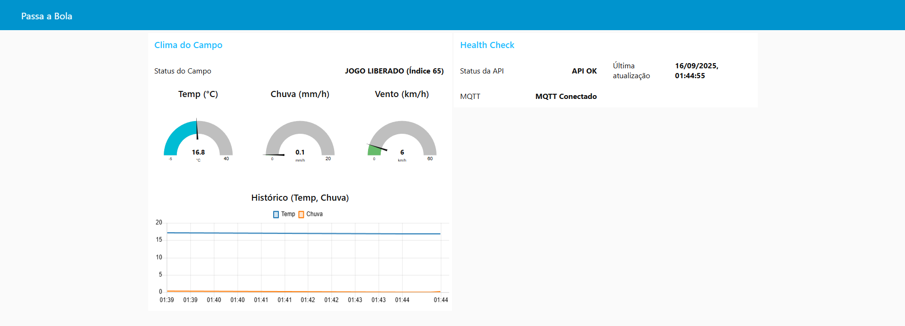

# 🌐 Passa a Bola – Monitoramento Climático com IoT

## 📌 Descrição do Projeto
Este projeto foi desenvolvido como parte da disciplina **Edge Computing and Computer Systems (Sprint 3)**.  
O objetivo é aplicar **IoT** no desafio *Passa a Bola*, criando um protótipo capaz de **avaliar em tempo real se o clima está propício para jogos de futebol feminino**.

A solução utiliza **Node-RED** e **Mosquitto (MQTT)** para coletar e processar dados climáticos (via API), calcular um índice de jogabilidade e exibir o resultado em um painel interativo.

---

## 👥 Integrantes
- Caio Marques Lins | RM: 559805  
- Murilo Gonzalez Bez Chleba | RM: 566199  
- Bernardo Lozório Gomes Y Gomes | RM: 564943  

---

## 🏗️ Arquitetura Proposta


**Componentes:**
- **Open-Meteo API** → fornece dados de temperatura, chuva e vento.  
- **Node-RED** → processa dados, calcula índice e atualiza widgets.  
- **Mosquitto (MQTT)** → canal de publicação para expansão futura.  
- **Dashboard Node-RED (/ui)** → exibe status, gauges e histórico em tempo real.  

---

## ⚙️ Tecnologias Utilizadas
- **Node.js** v22+  
- **Node-RED** v4.1.0  
- **Node-RED Dashboard** v3.6.6  
- **Mosquitto (MQTT Broker)**  
- **Open-Meteo API** (simulação de sensores)  

---

## 🚀 Como Executar o Projeto

### 1. Instalar dependências
```bash
# Dentro do diretório do Node-RED (ex.: ~/.node-red)
npm install node-red-dashboard
```

### 2. Iniciar Mosquitto
```bash
# Windows (instalado como serviço)
net start mosquitto

# Ou manual:
mosquitto.exe -v
```

### 3. Rodar Node-RED
```bash
node-red
```

### 4. Importar Flow
- Abra o editor em [http://localhost:1880](http://localhost:1880).  
- Menu → Import → cole o JSON do fluxo.  
- Deploy.

### 5. Acessar o Dashboard
[http://localhost:1880/ui](http://localhost:1880/ui)  

---

## 📊 Demonstração
- **Status do Campo** → exibe decisão final (*Liberado, Avaliar, Desaconselhado, Suspenso*).  
- **Gauges** → temperatura, chuva e vento.  
- **Histórico** → gráfico em tempo real de temperatura e chuva.  



---

## 📹 Vídeo Explicativo
➡️ [Link para o vídeo no YouTube](https://youtu.be/rzKAcVHiy4w)

---

## 📂 Estrutura do Repositório
```
/pab-iot-bmc
 ├── flows/
 │    └── node_red_flow_passa_a_bola_clima.json   # Fluxo completo do Node-RED
 ├── README.md
 └── imagens/
      ├── dashboard.png   # Print do painel
      └── flow.png        # Print do flow no Node-RED
```

---

## 📌 Observações
- O fluxo pode ser estendido para incluir **sensores reais** em vez da API.  
- O MQTT já está configurado para publicar em `passa_bola/campo1/clima`, permitindo integração futura.  
- Projeto focado em **simplicidade, clareza e aplicabilidade prática**.  
